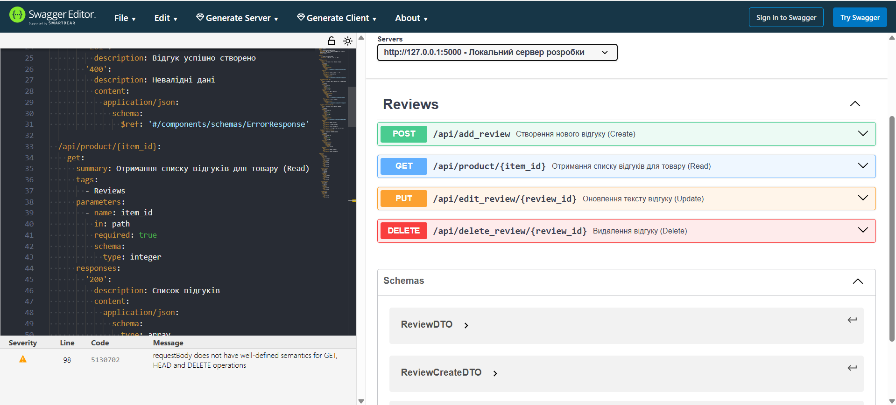
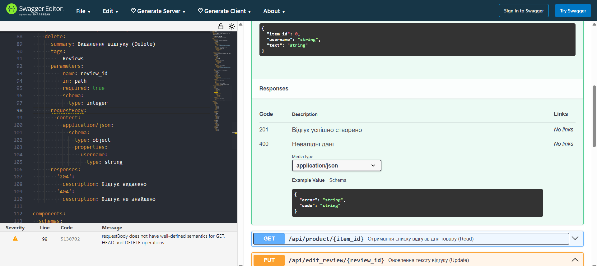

#  Reviews

- http://127.0.0.1:5000/api/health - GET /health (повертає “ok”).
-  python -m unittest tests/test_review_service.py - запуск юніт тестів

1. [openapi.yaml](openapi.yaml)
2. 
3. 

## Таблиця API ендпоїнтів для відгуків (Clothify Store)

| Метод | Ендпоїнт | Опис дії | Статус успіху |
| :--- | :--- | :--- | :--- |
| **GET** | `/api/product/{item_id}` | Отримання списку всіх відгуків для конкретного товару. | `200 OK` |
| **POST** | `/api/add_review` | Створення нового відгуку. Перевіряє текст на порожнечу. | `201 Created` |
| **PUT** | `/api/edit_review/{review_id}` | Повне оновлення тексту відгуку (тільки для автора). | `200 OK` |
| **DELETE** | `/api/delete_review/{review_id}` | Видалення відгуку з бази за його ідентифікатором. | `204 No Content` |

### Примітки до реалізації API:

* **Валідація порожнього тексту (404)**: Для методу `POST` реалізовано серверний фільтр: якщо поле відгуку порожнє або містить лише пробіли, сервер повертає статус `404 Not Found`.
* **Валідація довжини тексту (400)**: Для методу `PUT` реалізовано перевірку довжини — текст має містити мінімум 5 символів, інакше повертається статус `400 Bad Request`.
